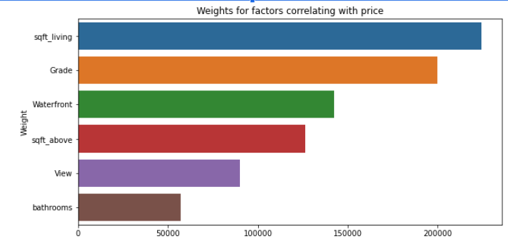
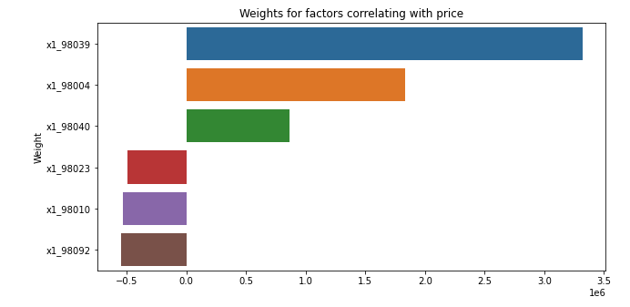
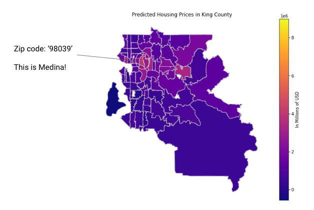

# King County Real Estate Linear Regression Model

Authors: Forrest Williams and Jamie Carnevale

## Overview

Hello Real Estate Investment Firm! We have creeated a predictive model for you that can help with your investment decisions!

## Business Undersatnding

Modelling various factors with price in King County, Washington can help investment firms evaluated purchase opportunities for specific properties. It can also help make decisions on localities to purchase within.

## Features of our Model

We ended up with a 70 percent significance level (R-squared value). This model included various features including but not limited to: whether or not the property is on the water, the sewage system used, whats the grade of the property (e.g. mansion or luxury graded), square feet of the lot.

From these various features, we noticed some factors are more important than others.

## Example Important Features

* square feet living
* zip code
* grade
* waterfront

* note: zip code was not included in this graph even though it is highly correlated

## Value Add: We can model increases and decreases in price based on what factors you would like to change

### For Example

A 3BR2BA
2270 SqFt 

Predicted sale price: $724758.07
Sale Price (Additional Bathroom): $730039.94
Sale Price (Additional 200 sqft): $747086.14

## Further Value Add

We mentioned square feet living is an important predictor of price

The 5 highest average lot sizes in square feet are close to these areas:

RAVENSDALE    149013
FALL CITY      95806
VASHON         92571
CARNATION      79717
ENUMCLAW       68958
DUVALL         57428

These areas give room to increase square feet living and therefore room to increase the value of property.

## 3 Zip Codes Most and Least Correlated with Price

Depending on the size of the investment you would like to make, we have data on which areas are most and least correlated to price. The zip code "98039" (Which corresponds to Medina) is by far the zip code that is the most highly correlated with price. This would be a great area to invest if you are looking for big budget investments.

## Predicted Price by Zip Code

We can use our model to predict the price of a home according to a certain zip code. This data should be similar to actual data, but in actually is our predicted data. Let's take a quick look at a heat map that separates areas in King County by zip code and color codes according to predicted price.

As expected, Medina is the lightest and therefore the area with the highest predicted home values.

## Conclusion

Our model, based on a variety of factors, can accurately predict price based on factors such as the area you are interested in
* This can help in determining whether or not a property is undervalued or overvalued
Next Steps:
* Add more data to model to boost its accuracy
* Create an web application with a clean input output system that is user friendly and interactable
* Create more predictions based off the variables we have in our model

